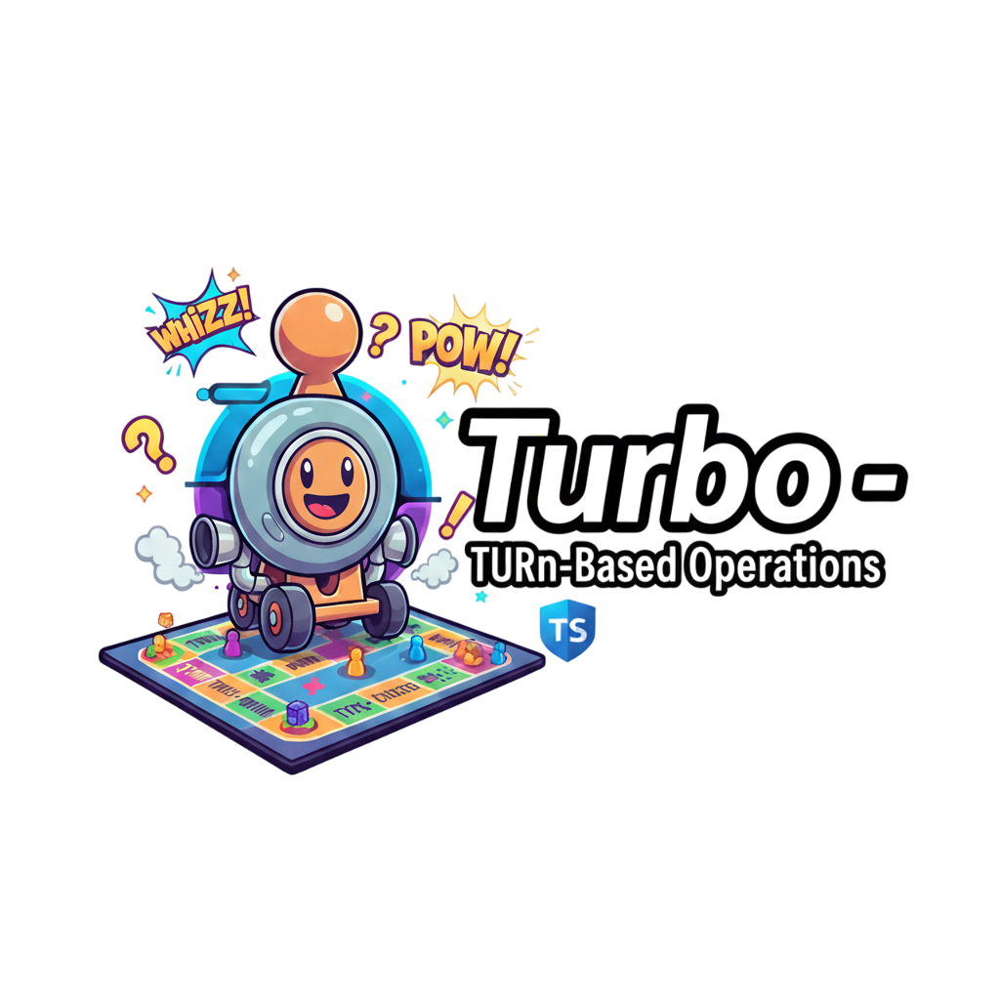

<div align="center">
  

  # TURBO

  **TURn-Based Operations**

  A modern, type-safe TypeScript library for building turn-based games

  [](https://opensource.org/licenses/MIT)
  [](https://www.typescriptlang.org/)
  [](https://www.npmjs.com/package/@bloombeasts/turbo)
</div>

---

## Features

- 🎮 **Generic Game Controller** - Flexible architecture for any turn-based game
- 🤖 **Built-in AI Support** - Multiple AI strategies included:
  - Random AI - Simple random move selection
  - Greedy AI - Selects moves based on immediate value
  - Minimax AI - Classic game theory algorithm with alpha-beta pruning
  - MCTS AI - Monte Carlo Tree Search for complex decision making
- 📝 **Type Safety** - Full TypeScript support with strict typing
- 🔄 **State Management** - Built-in undo/redo and history tracking
- 📢 **Event System** - Type-safe event-driven architecture
- ⚡ **Performance Optimized** - Efficient cloning and state updates
- 🎯 **Zero Dependencies** - Pure TypeScript implementation
- 📦 **Standalone Bundle** - Single-file deployment option for restricted environments

---

## Installation

```bash
npm install @bloombeasts/turbo
```

---

## Quick Start

```typescript
import { GameController, IGameRules, PlayerType, IGameState, IGameAction } from '@bloombeasts/turbo';

// Define your game state
interface MyGameState extends Record<string, unknown> {
  score: number;
  board: string[][];
}

// Define your actions
interface MyGameAction extends IGameAction {
  type: 'move' | 'pass';
  position?: { x: number; y: number };
}

// Implement game rules
class MyGameRules implements IGameRules<MyGameState, MyGameAction> {
  initializeGameData(config: IGameConfig): MyGameState {
    return {
      score: 0,
      board: Array(3).fill(null).map(() => Array(3).fill(''))
    };
  }

  validateAction(state: IGameState<MyGameState>, action: MyGameAction): IActionValidation {
    // Implement your validation logic
    return { valid: true };
  }

  executeAction(state: IGameState<MyGameState>, action: MyGameAction): IActionResult<MyGameState> {
    // Implement your game logic
    const newState = { ...state };
    // ... modify state based on action
    return {
      state: newState,
      success: true
    };
  }

  checkWinCondition(state: IGameState<MyGameState>): { winner: string | null; isDraw: boolean } {
    // Implement win condition check
    return { winner: null, isDraw: false };
  }

  getValidActions(state: IGameState<MyGameState>): MyGameAction[] {
    // Return list of valid actions for current state
    return [];
  }
}

// Create and use the game
const rules = new MyGameRules();
const game = new GameController(rules);

game.initialize({
  players: [
    { id: 'p1', name: 'Alice', type: PlayerType.HUMAN },
    { id: 'p2', name: 'Bob', type: PlayerType.AI }
  ]
});

// Execute actions
const action: MyGameAction = {
  type: 'move',
  playerId: 'p1',
  position: { x: 0, y: 0 }
};
const result = game.executeAction(action);
```

---

## AI Integration

TURBO includes multiple AI strategies that you can use out of the box:

```typescript
import { RandomAI, GreedyAI, MinimaxAI, MCTSAI, AILevel } from '@bloombeasts/turbo';

// Random AI - Good for testing
const randomAI = new RandomAI({
  playerId: 'ai-player',
  difficulty: AILevel.EASY
});

// Greedy AI - Makes locally optimal moves
const greedyAI = new GreedyAI({
  playerId: 'ai-player',
  difficulty: AILevel.MEDIUM
});

// Minimax AI - Classic game theory approach
const minimaxAI = new MinimaxAI({
  playerId: 'ai-player',
  difficulty: AILevel.HARD,
  maxDepth: 6
});

// MCTS AI - Advanced decision making
const mctsAI = new MCTSAI({
  playerId: 'ai-player',
  difficulty: AILevel.EXPERT,
  simulationCount: 1000
});

// Register AI with game controller
game.registerAI(randomAI);

// Get AI's chosen action
const aiAction = await randomAI.chooseAction(game.getState(), rules);
game.executeAction(aiAction);
```

---

## Standalone Bundle

For environments where npm installation isn't available (like Meta Horizon or other restricted platforms), TURBO provides a standalone TypeScript file:

```bash
npm run build:standalone
```

This generates `Turbo-Standalone.ts` - a single file containing the entire library wrapped in a namespace:

```typescript
// Use via the Turbo namespace
const game = new Turbo.GameController(rules);
const ai = new Turbo.RandomAI({ playerId: 'ai', difficulty: Turbo.AILevel.MEDIUM });

// Access all types
type GameState = Turbo.IGameState;
type Player = Turbo.IPlayer;
```

---

## Core Concepts

### Game State
The game state includes:
- `gameData` - Your custom game-specific state
- `turnInfo` - Current turn number and active player
- `players` - List of players in the game
- `phase` - Current game phase (setup, playing, completed, etc.)
- `isComplete` - Whether the game has ended
- `winnerId` - ID of winning player (if game is complete)

### Game Rules
Implement the `IGameRules` interface to define your game:
- `initializeGameData()` - Set up initial game state
- `validateAction()` - Check if an action is legal
- `executeAction()` - Apply an action to the state
- `checkWinCondition()` - Determine if the game has ended
- `getValidActions()` - List all legal moves (required for AI)

### Event System
Subscribe to game events:

```typescript
import { EventBus } from '@bloombeasts/turbo';

const eventBus = new EventBus();

eventBus.on('game:started', (data) => {
  console.log('Game started!', data);
});

eventBus.on('turn:changed', (data) => {
  console.log('Turn changed to player:', data.playerId);
});

eventBus.on('game:ended', (data) => {
  console.log('Game ended! Winner:', data.winnerId);
});
```

---

## Examples

Check out the `examples/` directory for complete implementations:

- **TicTacToe.example.ts** - Classic game with AI opponent
- **simple-card-game.ts** - Turn-based card game with hand management

---

## API Documentation

### GameController

```typescript
class GameController<TState, TAction> {
  // Initialize the game with players and configuration
  initialize(config: IGameConfig): void;

  // Execute a game action
  executeAction(action: TAction): IActionResult<TState>;

  // Get current game state
  getState(): IGameState<TState>;

  // Undo last action
  undo(): boolean;

  // Redo previously undone action
  redo(): boolean;

  // Register an AI player
  registerAI(ai: IAIPlayer): void;

  // Subscribe to events
  on(event: string, handler: Function): void;
}
```

### AI Difficulty Levels

```typescript
enum AILevel {
  EASY = 'easy',      // Faster, less sophisticated
  MEDIUM = 'medium',  // Balanced
  HARD = 'hard',      // Slower, more sophisticated
  EXPERT = 'expert'   // Slowest, most sophisticated
}
```

---

## Building

```bash
# Build the library
npm run build

# Build standalone bundle
npm run build:standalone

# Run tests
npm test

# Run tests in watch mode
npm run test:watch

# Generate coverage report
npm run test:coverage
```

---

## Contributing

Contributions are welcome! Please feel free to submit a Pull Request.

---

## License

MIT License - see the [LICENSE](LICENSE) file for details

---

## Credits

Built with ❤️ by the Suppers AI team

Repository: [https://github.com/suppers-ai/turbo](https://github.com/suppers-ai/turbo)
